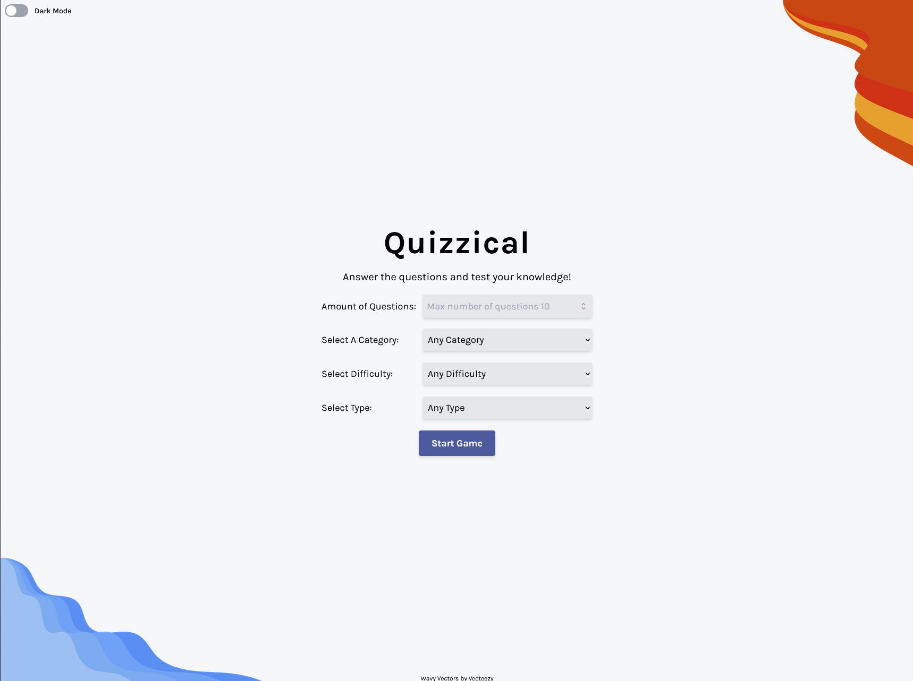
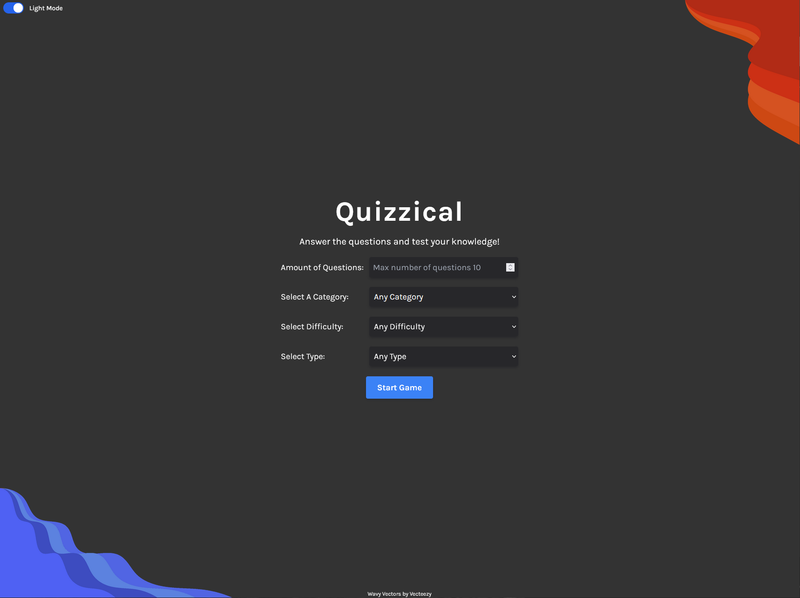
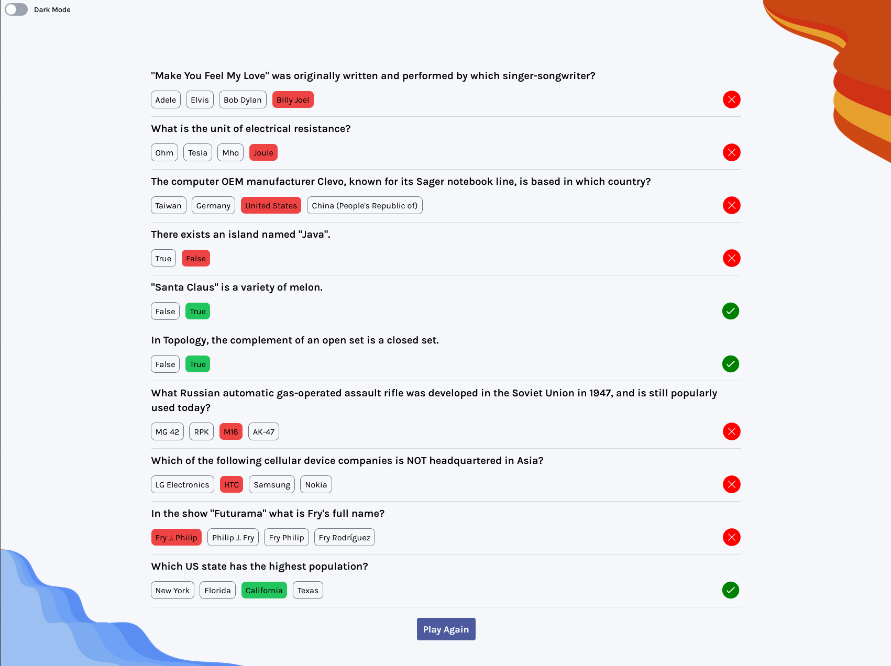

# Quizzical

Quizzical is a web app quiz game made using the [Open Trivia DB](https://opentdb.com/api_config.php). It gets trivia questions from Open Trivia API and then based on the answer you get a score. There are multiple difficulties and categories and you can get up to 10 questions at a time. This project is the final solo project from Scrimba's React Course. It's made using React and Tailwind CSS.

App link deployed with Vercel https://quizzical-game-mu.vercel.app/

## Build with:
HTML  
CSS  
Javascript  
React JS  
Tailwind CSS
## Installation

In order to run the project locally you can just fo to the projects folder and type in terminal:

```bash
cd quizzical-game
npm install
npm run dev
```

## Screenshots



